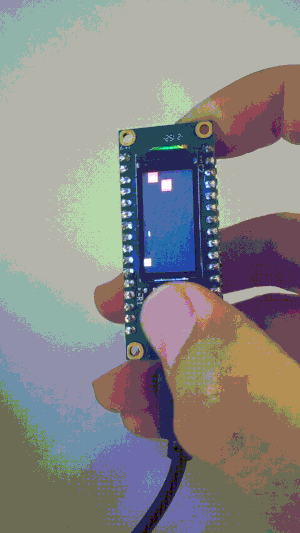

# air101-airwar

> 在合宙 Air101 开发板+LCD扩展版 上开发一个飞机大战游戏。

## 说明

目前只是用色块来代表玩家飞机、敌机和炮弹。因为绘制矩形比较容易。

下一个版本会绘制像素风格的飞机。

## 配置

由于lutaIDE只能在windows下开发，因此导入本项目，需要更改`luatide_project.json` 文件中的 `lib_path` 和 `app_file`

## demo

